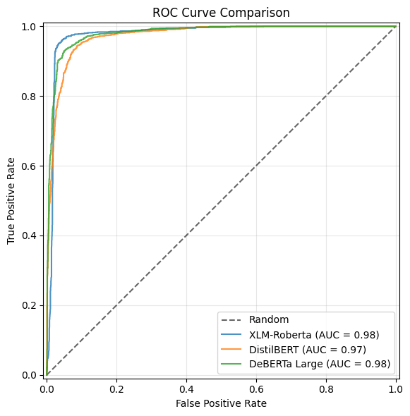

# Project Report: Evaluation System for Formality Detection Models

## Introduction

This document contains a discussion of the work completed in this project, the thought process behind the overall approach, the main challenges faced, and the key takeaways from this work.

## Justification of the Overall Approach

Formality detection can be framed as a regression task, where we seek to determine the level of formality along a continuous scale, or as a binary classification task, where we classify instances as belonging to one of two classes: formal or informal. 

For this project, the decision was made to frame formality detection as a binary classification task, as this simplifies the comparison of models and facilitates the use of pre-trained models from the work of [Dementieva et al.](https://arxiv.org/pdf/2204.08975) which are available on Hugging Face. These models were identified as being suitable for this task due to the relative recency of the research (2023). The best-performing models from this research are transformer-based, which remains the leading choice for NLP applications. Given their strong performance, they likely reflect the current state of the art for this task.

These models were trained using the [GYAFC](https://github.com/raosudha89/GYAFC-corpus) and [X-FORMAL](https://github.com/Elbria/xformal-FoST) datasets. These are the two most prominent datasets available for formality detection/formality style transfer - according to Dementieva et al. they are the only readily available text collections with formality annotation (direct formal-informal pairs). However, access to these datasets must be requested from the authors after gaining access to the [Yahoo Answers corpus](https://webscope.sandbox.yahoo.com/catalog.php?datatype=l) upon which they are based. 

I requested access to this data from Yahoo, but did not receive a timely response, therefore an alternative dataset was required. Furthermore, a new dataset is actually preferable as it produces a fairer comparison of any new formality classifiers against the pre-trained models: the models were fine-tuned on this data, which gives them a clear advantage, whereas a new dataset results in a comparison of model performance on unseen data.

Therefore, the overall plan for this project involved the following: 

* Identify and adapt a new dataset for binary classification of text formality and perform some exploratory analysis to verify its suitability for this task.
* Identify suitable pre-trained models (available on Hugging Face) from the work of Dementieva et al. for use as baseline/benchmark models against which new models can be compared in the future.
* Identify suitable quantitative metrics and evaluate the performance of the pre-trained models along these metrics when classifying the new, unseen data.

## Methods

### 1. Dataset

The data used in this project is adapted from the [Pavlick Formality Scores](https://huggingface.co/datasets/osyvokon/pavlick-formality-scores) dataset from the work of [Pavlick et al.](https://aclanthology.org/Q16-1005.pdf) The data stems from an empirical study of linguistic formality that involved collecting human annotations on sentence-level formality. It includes English language texts from four distince genres: news, blogs, emails, and online question forums. Each sentence was annotated by 5 human judges using a 7-point Likert scale ranging from -3 (very informal) to +3 (very formal). It is repurposed here for a binary classification task.

The dataset is transformed from a continuous regression task into a binary classification task by applying a threshold to the absolute value of the mean formality scores. This ensures that examples with an ambiguous level of formality are discarded. The filtered dataset is divided into two classes by classifying the remaining instances as either informal or formal based on the negativity/positivity of their scores. The dataset is evenly balanced across the two classes. 

Before using the data, I performed some exploratory analysis to investigate the separability of the data based on the two classes through visualisation. This is accomplished by vectorising the data using a pre-trained model, then performing a dimensional reduction of the vectorised so that it can be plotted in two or three dimensions. The pre-trained [GloVe-25 model](https://huggingface.co/fse/glove-twitter-25) was selected for this purpose as I had previous experience in using this model from [another project](https://github.com/fergalriordan/DeceptionClassifiers). Dimensionality reduction was performed using t-distributed Stochastic Neighbour Embedding, and the data was then plotted in 2D and 3D. For a more thorough overview of the dataset, consult the [Jupyter notebook](../scripts/data_visualisation.ipynb).

  <em>t-SNE visualisation of dataset embeddings for the full dataset (left) and the filtered binary dataset (right). Note that a clear separation between the two classes can be observed.</em>

The goal in visualising the data using t-SNE is to investigate if any separation exists between the two classes as a result of the vectorisation performed by the pre-trained model. If the classes appear to be separable, this indicates that there are underlying differences between the content (semantic or otherwise) in these two classes, and it therefore should be possible to train an effective classifier for this data. Failure of any of the pre-trained models to effectively classify this data is therefore not as a result of an issue with the dataset, and instead with the model's ability to generalise to new data. As can be seen in the image above, a clear separation exists between the two classes.

### 2. Metrics

To evaluate the performance of the models in classifying formality, the following standard metrics were used:

- **Accuracy**: The proportion of correctly classified examples out of the total number of examples.
- **Precision**: The proportion of correctly predicted positive instances (formal class) out of all predicted positive instances.
- **Recall**: The proportion of correctly predicted positive instances out of all actual positive instances in the dataset.
- **F1-score**: The harmonic mean of precision and recall, providing a balanced measure of model performance.

In addition to these standard metrics, **Receiver Operating Characteristic (ROC)** curves were generated for each model to visualize their performance across different classification thresholds. The **Area Under the Curve (AUC)** was also computed to provide a single-value measure of the model's ability to distinguish between formal and informal text. A higher AUC indicates better discrimination between the two classes.

#### Additional Considerations

While the classification models were evaluated using discrete labels (formal vs. informal), the original dataset contained continuous formality scores. One potential avenue for further analysis would be to compare the model logits (continuous confidence scores for predictions) with these original formality scores. If a strong correlation exists, this would suggest that the models not only classify text as formal or informal but also capture the degree of formality in a meaningful way. Due to time constraints, this analysis was not conducted in this project but remains an interesting future direction.

### 3. Models

As previously stated, the models used in this project are pre-trained models that stem from the work of [Dementieva et al.](https://arxiv.org/pdf/2204.08975) and are available on Hugging Face. Specifically, the following models were used: 

- [**XLM-Roberta-based Model**](https://huggingface.co/s-nlp/xlmr_formality_classifier): Produced by fine-tuning the [XLM-RoBERTa](https://huggingface.co/docs/transformers/en/model_doc/xlm-roberta) model on the multilingual formality classification dataset [X-FORMAL](https://github.com/Elbria/xformal-FoST).
- [**mDistilBERT-based Model**](https://huggingface.co/s-nlp/mdistilbert-base-formality-ranker): Produced by fine-tuning the [mDistilBERT (base)](https://huggingface.co/distilbert/distilbert-base-multilingual-cased) model on the [X-FORMAL](https://github.com/Elbria/xformal-FoST) dataset.
- [**DeBERTa-large-based Model**](https://huggingface.co/s-nlp/deberta-large-formality-ranker): Produced by fine-tuning the [DeBERTa (large)](https://huggingface.co/microsoft/deberta-v3-large) model on the English language formality classification dataset [GYAFC](https://github.com/raosudha89/GYAFC-corpus).

The rationale behind the selection of these models: 
- All three models are transformer-based, which aligns with the current state-of-the-art for NLP classification tasks.
- The XLM-Roberta-based model and the mDistilBERT-based model were fine-tuned on multilingual data, while the DeBERTa-large-based model was fine-tuned on monolingual data. This means that any new model we seek to evaluate can be compared with models of varying linguistic scope.
- The Pavlick Formality Scores dataset used in this project is monolingual so it would be reasonable to expect the DeBERTa-large-based model to display the strongest performance. However, it is interesting to evaluate how the multilingual models can generalise to new data for a monolingual classification task.

### 4. Model Evaluation Environment

One challenge faced when handling these relatively large classification models was the computational resources and time required to perform the evaluations. Due to the time constraints of this project, instead of using the full Pavlick Formality Scores dataset for evaluation, only the test split was used. This ensured that all evaluations could be performed in a timely manner. Furthermore, Google Colab was used in order to access GPUs, further speeding up the process. 

If additional time was allotted to this project, the full dataset could have been used, or the models could even be fine-tuned on the training split to investigate its effects on test performance. 

## Results and Conclusions

The confusion matrices and performance metrics of the three models can be seen below. As expected, the monolingual DeBERTa large-based model displays the strongest performance overall, though all three models display especially strong performance in the recall metric.

  <em>XLM-RoBERTa Model Confusion Matrix and Metrics</em>

  <em>mDistilBERT Model Confusion Matrix and Metrics</em>

  <em>DeBERTa Large Model Confusion Matrix and Metrics</em>

The ROC curves of the three models are compared below, along with their AUC values. The three models display strong performance here, though the mDistilBERT model is slightly outperformed by the other two models.

  <em>ROC Curve Comparison. Note that the AUC is plotted in the legend.</em>

## Final Thoughts

A comprehensive system for evaluating new formality classification models has been implemented - the dataset is clearly suitable for the task, and the three transformer-based models provide a solid benchmark against which new models can be compared. The evaluation environment is intuitive to use (a simple Jupyter notebook) - by following the documentation, it should be straightforward to use this evaluation system to assess the performance of new models.

This project also presents scope for additional work. In particular, it would be interesting to investigate if the logits outputted by the models are correlated with the formality scores in the Pavlick Formality Scores dataset. 